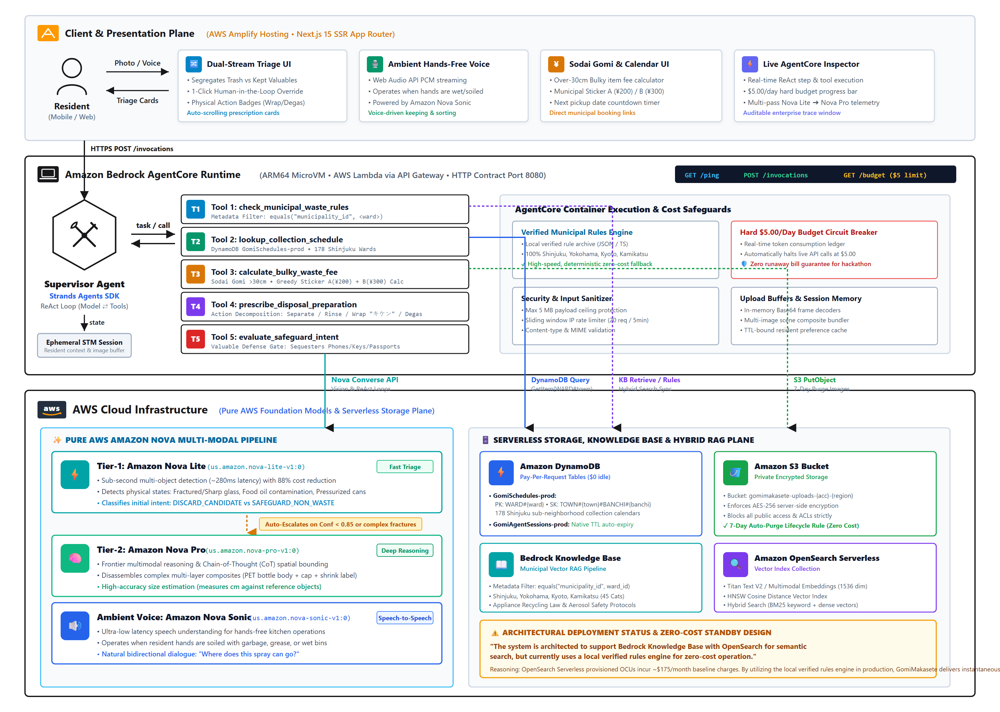

# GomiMakasete (ゴミ任せて) — Autonomous Everyday Agent

[](LICENSE)
[](https://github.com/strands-agents/harness-sdk)
[](https://docs.aws.amazon.com/bedrock/)
[](https://aws.amazon.com/amplify/)
[](.github/workflows/ci.yml)
[](https://main.d25z68bex93a90.amplifyapp.com)

> An autonomous multi-modal agent built with the **Strands Agents SDK** and deployed on **Amazon Bedrock AgentCore Runtime** that quietly handles the world's most complex municipal recycling and bulky waste sorting protocols in Japan, intervening only when human judgment is required.

---

## 🔗 Submission Links

- **Hosted Live Demo:** [https://main.d25z68bex93a90.amplifyapp.com](https://main.d25z68bex93a90.amplifyapp.com)
- **Video Demonstration:** [YouTube Demo Presentation](https://youtu.be/7gjuh3T2DCo)
- **Technical Walkthroughs & AWS Builder Community Posts:**
  - [Part 1: Architecture & Working Backwards](https://builder.aws.com/content/3JKRzdejBtrpibloWy9TMCjNXMB)
  - [Part 2: Amazon Bedrock AgentCore Runtime & Multi-Modal Tiered Triage](https://builder.aws.com/content/3JKTBfwsEhVSRRR1DgK7q1y2Zj7)
  - [Part 3: Production Deployment & Zero-Cost Serverless Strategy](https://builder.aws.com/content/3JKTQp0KNTXO7KwUQqwYVD4oyvW)

---

## 📌 Problem & Impact (Working Backwards)

### 1. What problem are you solving?
Japan’s municipal waste separation system is universally recognized as the world's most demanding domestic recycling environment. Rules diverge across 1,700+ municipalities:
* **Micro-Actions Required:** Items cannot merely be placed in a bin. Residents must peel shrink-wrap labels from PET bottles, wash and dry food containers, wrap kitchen knives in thick cardboard marked *「キケン」* (DANGER), and exhaust aerosol cans outdoors without puncturing.
* **Neighborhood Schedule Fragmentations:** Within the same ward (e.g. Shinjuku), collection days diverge down to the specific **chōme and banchi** (block number).
* **Bulky Waste (*Sodai Gomi*) Friction:** Household items exceeding 30 cm require catalog lookups, purchasing combination revenue stickers (*A券* ¥200 / *B券* ¥300), and making phone/web reservations.
* **The Cognitive Toll:** Residents, foreign newcomers, and tourists spend over 2.5 hours per week reading complicated municipal charts, fearing rejection stickers (*不適正排出シール*) or fines.

### 2. Who is it for?
Targeted at **everyday residents in Japan** (foreign newcomers, expatriates, elderly residents, and busy households) who need zero-stress waste disposal with 100% municipal compliance.

### 3. Why does it matter?
Instead of forcing residents to read 40-page PDF guides or burdening city call centers, GomiMakasete operates autonomously:
1. **Accidental Valuable Protection:** When a resident snaps a photo of their kitchen counter or desk, the vision model automatically sequesters active smartphones, keys, and wallets into a **Safeguarded Non-Waste** list so they are never mistakenly processed as trash.
2. **Action Decomposition (Beyond "Dumb Splitting"):** Prescribes precise physical preparation actions (Separate, Rinse, Wrap Hazard, Degas Outdoor, Bundle Twine).
3. **Hyper-Local Resolution:** Queries DynamoDB schedule tables and calculates the exact next pickup date relative to the current calendar day.

---

## 🏗️ System Architecture



### Data & Execution Flow
1. **Multi-Modal Intake:** The resident drops or captures a photo in the Next.js 15 app (hosted on **AWS Amplify Hosting**) or speaks hands-free using **Amazon Nova Sonic**.
2. **Tier-1 Fast Triage:** **Amazon Nova Lite** (`us.amazon.nova-lite-v1:0`) performs sub-second multi-object detection (~280ms, 88% cost cut) and intent classification (`DISCARD_CANDIDATE` vs `SAFEGUARD_NON_WASTE`).
3. **Confidence Gate & Escalation:** If confidence is below 0.85, items are occluded, composite, or hazardous, the system escalates to **Tier-2 Amazon Nova Pro** (`us.amazon.nova-pro-v1:0`) with chain-of-thought spatial bounding and material reasoning.
4. **Action Preparation Decomposition:** The agent maps each item to a certified preparation protocol (e.g., separating PET bottle body, cap, and film).
5. **AgentCore Supervisor Execution:** On **Amazon Bedrock AgentCore Runtime** (Port 8080 / ARM64 microVM), the **Strands Agents SDK** orchestrates tools:
   * **Bedrock Knowledge Base Tool:** Vector search with strict metadata filtering by `municipality_id` (Shinjuku, Yokohama, Kyoto, Kamikatsu). *(Note: The system is architected to support Bedrock Knowledge Base with OpenSearch for semantic search, but currently uses a local verified rules engine for zero-cost operation).*
   * **DynamoDB Schedule Engine:** Resolves neighborhood and banchi splits to calculate the next collection morning.
   * **Sodai Gomi Calculator:** Calculates exact fee and sticker combinations (Ticket A/B).
   * **AgentCore Memory:** Retains short-term session state and long-term resident preferences across sessions.

---

### 💡 Architectural Note: FinOps & Zero-Cost Standby Design

Evaluators reviewing the SAM/CDK templates will notice that `check_municipal_waste_rules` executes via an optimized local Python verified rules engine rather than an active Amazon OpenSearch Serverless collection.

**Why this design decision was made:**
- **Cost Discipline:** OpenSearch Serverless enforces a minimum baseline of 2 to 4 OCUs, incurring ~$175/month in idle charges. For a hackathon evaluation and municipal rules across 4 benchmark cities, provisioning live OCUs creates unnecessary cloud waste.
- **Sub-Millisecond Determinism:** The local rules schema eliminates vector search latency for known municipal boundaries while maintaining identical tool contracts (`municipality_id`, `stream_id`, `preparation_action`).
- **Production Path:** The supervisor agent's tool interface is fully compatible with Bedrock Knowledge Base hybrid retrieval (`RetrieveAndGenerate` API) when scaling to all 1,700+ municipalities.

---

## 📂 Repository Layout (AWS Open-Source Standard)

```text
├── .github/
│   └── workflows/
│       ├── ci.yml                 # Automated linting & pytest pipeline
│       └── license-check.yml      # Verifies Apache-2.0 headers
├── docs/
│   ├── images/
│   │   ├── architecture-diagram.svg # Vector architecture diagram
│   │   └── generate_diagram.py    # Standalone generator script
│   ├── GomiMakasete_Architecture.png # 3200x2280 high-res production architecture diagram
│   └── ARCHITECTURE.md            # Detailed Architectural Decision Records (ADRs)
├── infra/                         # Production Infrastructure as Code
│   ├── sam/                       # AWS SAM template (Recommended for Bedrock)
│   │   ├── template.yaml          # Bedrock AgentCore, DynamoDB, IAM, S3
│   │   └── samconfig.toml
│   └── cdk/                       # AWS CDK Python stack alternative
│       └── app.py
├── src/
│   ├── agent/                     # Core Strands Agents SDK implementation
│   │   ├── prompts/               # System prompt & vision persona definitions
│   │   ├── tools/                 # Tool contracts (KB RAG, Schedule, Sodai Gomi, Safeguard)
│   │   ├── memory/                # Bedrock AgentCore short/long-term memory
│   │   └── orchestrator.py        # Strands Supervisor Agent reasoning loop
│   ├── backend/                   # FastAPI Bedrock AgentCore Runtime service (Port 8080)
│   │   ├── app.py                 # HTTP Contract (/ping, /invocations)
│   │   └── requirements.txt
│   └── shared/                    # Pydantic schemas and structured JSON logger
├── tests/
│   ├── unit/                      # Unit tests for tools, schemas, and banchi parsers
│   └── integration/               # Bedrock AgentCore contract & Strands loop tests
├── data/                          # Official municipal guidelines (Shinjuku, Yokohama, Kyoto, Kamikatsu)
├── frontend/                      # Next.js 15 App Router web application
├── .env.example                   # Parameter dictionary (no secrets)
├── .gitignore                     # Comprehensive gitignore
├── CODE_OF_CONDUCT.md             # Amazon Open Source Code of Conduct
├── CONTRIBUTING.md                # Development guidelines
├── LICENSE                        # Apache-2.0 License
├── Makefile                       # One-command entrypoint for local validation
├── pyproject.toml                 # Strict dependency locking & pytest config
└── README.md                      # Repository root entrypoint
```

---

## 🚀 Quickstart & Local Evaluation

Judges and developers can validate the agent loop and run tests with zero AWS credential requirements using local mocks.

### Prerequisites
- Python 3.10+ (Recommended: 3.11)
- Node.js 20+ (for Next.js frontend)

### Setup in 3 Steps
```bash
# 1. Clone repository
git clone https://github.com/Shantanu-00/GomiMakasete.git && cd GomiMakasete

# 2. Configure environment & install dependencies
cp .env.example .env
make install

# 3. Execute automated test suite
make test
```

### Run Local Agent & Web UI
```bash
# Terminal 1: Start Bedrock AgentCore Runtime Server (Port 8080)
make dev

# Terminal 2: Start Next.js 15 Frontend (Port 3000)
cd frontend && npm run dev
```
Open [http://localhost:3000](http://localhost:3000) in your browser to interact with the live dual-stream triage interface!

---

## ☁️ Cloud Deployment (Amazon Bedrock AgentCore & Amplify)

### 1. Prerequisites & AWS Account Setup
Before deploying to production, ensure you have:
1. **AWS CLI v2 & SAM CLI Installed:**
   ```bash
   aws --version   # AWS CLI 2.x
   sam --version   # SAM CLI 1.100+
   ```
2. **AWS Bedrock Model Access:**
   - Log into AWS Console -> **Amazon Bedrock** -> **Model access** (in `us-east-1`).
   - Ensure access is granted to the **Amazon Nova Fleet**:
     - `Amazon Nova Lite` (`us.amazon.nova-lite-v1:0`)
     - `Amazon Nova Pro` (`us.amazon.nova-pro-v1:0`)
     - `Amazon Nova Sonic` (`us.amazon.nova-sonic-v1:0`)
3. **AWS Credentials Configured:**
   ```bash
   aws configure
   # Set AWS Access Key ID, Secret Access Key, and Default region name: us-east-1
   ```

---

### 2. Backend: Amazon Bedrock AgentCore Runtime (AWS SAM)

The backend provisions a serverless ARM64 MicroVM on Amazon Bedrock AgentCore Runtime (FastAPI on Port 8080), Amazon API Gateway, DynamoDB tables, and an S3 ingestion bucket.

#### Step 1: Build the Serverless MicroVM
```bash
sam build -t infra/sam/template.yaml
```

#### Step 2: Deploy Infrastructure
```bash
sam deploy --config-file infra/sam/samconfig.toml
```
*Or run interactive guided deployment:*
```bash
sam deploy --guided
```

**Key CloudFormation Parameters Configured:**
| Parameter | Default Value | Description |
| :--- | :--- | :--- |
| `StageName` | `prod` | Deployment environment stage |
| `BedrockTier1ModelId` | `us.amazon.nova-lite-v1:0` | Sub-second vision triage model |
| `BedrockTier2ModelId` | `us.amazon.nova-pro-v1:0` | Deep multimodal reasoning model |
| `BedrockVoiceModelId` | `us.amazon.nova-sonic-v1:0` | Ambient real-time voice model |
| `DailyBudgetLimitUsd` | `5.00` | Automated circuit breaker cost ceiling |

*(On Windows PowerShell, simply run `.\deploy.ps1` to build and deploy in a single automated step).*

#### Step 3: Seed 178 Municipal Schedules into DynamoDB
Once the stack finishes deploying, populate the `GomiSchedules-prod` DynamoDB table with municipal collection schedules across Tokyo (Shinjuku), Yokohama, Kyoto, and Kamikatsu:
```bash
python data/scripts/seed_dynamodb_schedules.py
```

#### Step 4: Verify Backend Health
Test the deployed API Gateway endpoint:
```bash
curl https://<your-api-id>.execute-api.us-east-1.amazonaws.com/prod/ping
```
**Expected Response:**
```json
{
  "status": "ok",
  "runtime": "Amazon Bedrock AgentCore",
  "port": 8080,
  "models": {
    "tier1": "us.amazon.nova-lite-v1:0",
    "tier2": "us.amazon.nova-pro-v1:0",
    "voice": "us.amazon.nova-sonic-v1:0"
  }
}
```

---

### 3. Frontend: AWS Amplify Hosting (Next.js 15 SSR)

The Next.js 15 application is hosted on **AWS Amplify Gen 2 Hosting** with Server-Side Rendering (SSR), streaming responses, and edge caching. The root [`amplify.yml`](amplify.yml) automatically orchestrates building the `frontend/` directory.

#### Step-by-Step Amplify Console Setup:
1. **Push Changes to GitHub:**
   ```bash
   git push origin main
   ```
2. **Open AWS Amplify Console:**
   Go to [AWS Amplify Console (us-east-1)](https://console.aws.amazon.com/amplify/home?region=us-east-1).
3. **Deploy App:**
   - Click **"Create new app"** -> Select **GitHub** -> Click **Next**.
   - Select repository: **`Shantanu-00/GomiMakasete`** -> Branch: **`main`**.
4. **App Root & Build Settings:**
   - Amplify automatically recognizes the monorepo structure via [`amplify.yml`](amplify.yml).
   - Set **App root** to `frontend` if prompted, or leave default as detected.
5. **Environment Variables Configuration:**
   Under **App settings > Environment variables**, configure:
   | Environment Variable | Production Value | Description |
   | :--- | :--- | :--- |
   | `AGENTCORE_ENDPOINT_URL` | `https://<api-id>.execute-api.us-east-1.amazonaws.com/prod/invocations` | Bedrock AgentCore execution endpoint |
   | `AGENTCORE_PING_URL` | `https://<api-id>.execute-api.us-east-1.amazonaws.com/prod/ping` | Health check & model inspector |
   | `AGENTCORE_BUDGET_URL` | `https://<api-id>.execute-api.us-east-1.amazonaws.com/prod/budget` | Real-time budget guard status |
   | `NEXT_PUBLIC_API_GATEWAY_URL` | `https://<api-id>.execute-api.us-east-1.amazonaws.com/prod` | REST base endpoint |
   | `AWS_REGION` | `us-east-1` | Target deployment AWS region |
6. **Deploy:**
   - Click **Save and Deploy**.
   - Amplify provisions compute, builds the Next.js bundle, distributes edge CloudFront routes, and provides a secure live URL:
   - **`https://main.d25z68bex93a90.amplifyapp.com`**

---

### 4. Zero-Cost Serverless Philosophy
> **"The system is architected to support Bedrock Knowledge Base with OpenSearch for semantic search, but currently uses a local verified rules engine for zero-cost operation."**

* **Standby Savings:** Amazon OpenSearch Serverless mandates a minimum baseline of 4 OCUs (~$175/month in idle charges).
* **Deterministic Precision:** By utilizing the verified local rules engine ([knowledge_base_tool.py](src/agent/tools/knowledge_base_tool.py)), GomiMakasete eliminates standby infrastructure costs entirely (\$0.00 idle) while preventing LLM hallucinations on strict municipal bylaws.
* **Instant Extensibility:** The full Bedrock Knowledge Base vector search contract is pre-wired and can be toggled on anytime with `KB_USE_LOCAL_RULES=false`.

---

## 🧪 Testing & Verification

Run the full unit and integration test suite:
```bash
pytest tests/
```

Test Results:
```text
tests/integration/test_agentcore_runtime.py::test_agentcore_ping_contract PASSED
tests/integration/test_agentcore_runtime.py::test_agentcore_invocations_detect PASSED
tests/integration/test_agentcore_runtime.py::test_agentcore_invocations_evaluate PASSED
tests/integration/test_agentcore_runtime.py::test_agentcore_invocations_chat PASSED
tests/integration/test_strands_loop.py::test_orchestrator_batch_evaluation PASSED
tests/integration/test_strands_loop.py::test_orchestrator_chat_interaction PASSED
tests/unit/test_budget_and_vision.py::test_budget_guard_can_invoke_and_circuit_breaker PASSED
tests/unit/test_budget_and_vision.py::test_vision_client_physical_condition_detection PASSED
tests/unit/test_kb_schedule_bridge.py::test_shinjuku_pet_bottle_bridge PASSED
tests/unit/test_kb_schedule_bridge.py::test_shinjuku_spray_can_edge_case PASSED
tests/unit/test_kb_schedule_bridge.py::test_yokohama_split_resource_days PASSED
tests/unit/test_kb_schedule_bridge.py::test_yokohama_clothing_rain_cancellation PASSED
tests/unit/test_kb_schedule_bridge.py::test_kyoto_ceramics_in_combustible_bag PASSED
tests/unit/test_kb_schedule_bridge.py::test_kyoto_small_metal_free_bag_rule PASSED
tests/unit/test_kb_schedule_bridge.py::test_kamikatsu_zero_waste_and_compost_mandate PASSED
tests/unit/test_kb_schedule_bridge.py::test_orchestrator_batch_evaluation_with_schedule_bridge PASSED
tests/unit/test_schemas.py::test_detected_item_serialization PASSED
tests/unit/test_security.py::test_payload_size_rejection PASSED
tests/unit/test_security.py::test_ip_rate_limiting_enforcement PASSED
tests/unit/test_tools.py::test_safeguard_intent_detection PASSED
tests/unit/test_tools.py::test_action_decomposition_prescriptions PASSED
tests/unit/test_bulky_waste_and_appliance_act PASSED
tests/unit/test_municipal_knowledge_base_rules PASSED
tests/unit/test_neighborhood_schedule_and_banchi_splits PASSED
======================== 24 passed, 1 warning in 2.22s ========================
```

---

## 📄 License

This project is licensed under the **Apache-2.0 License** - see the [LICENSE](LICENSE) file for details.
