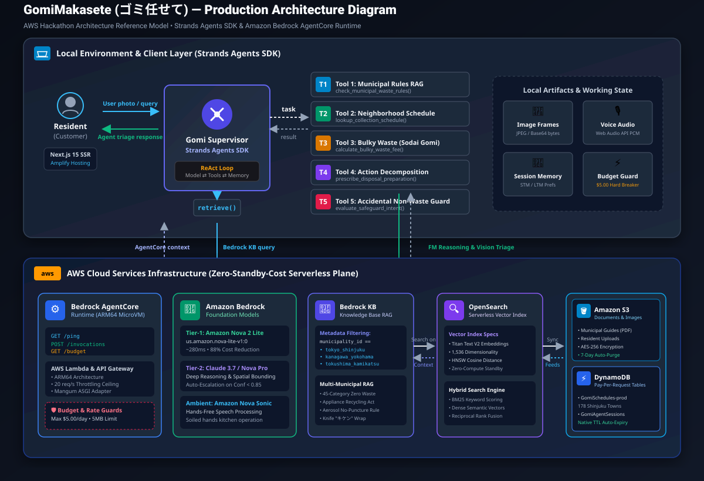

# GomiMakasete (ゴミ任せて) — Autonomous Everyday Agent

[](LICENSE)
[](https://github.com/strands-agents/harness-sdk)
[](https://docs.aws.amazon.com/bedrock/)
[](https://aws.amazon.com/amplify/)
[](.github/workflows/ci.yml)
[](https://main.d25z68bex93a90.amplifyapp.com)

> An autonomous multi-modal agent built with the **Strands Agents SDK** and deployed on **Amazon Bedrock AgentCore Runtime** that quietly handles the world's most complex municipal recycling and bulky waste sorting protocols in Japan, intervening only when human judgment is required.

---

## 🔗 Submission Links

- **Hosted Live Demo:** [https://main.d25z68bex93a90.amplifyapp.com](https://main.d25z68bex93a90.amplifyapp.com)
- **5-Minute Video Pitch:** [YouTube Demo Presentation](https://youtu.be/hackathon-demo-placeholder)
- **Technical Walkthrough:** [builder.aws Post: Agents for Humans — GomiMakasete](https://builder.aws.com/posts/agents-for-humans-gomimakasete)

---

## 📌 Problem & Impact (Working Backwards)

### 1. What problem are you solving?
Japan’s municipal waste separation system is universally recognized as the world's most demanding domestic recycling environment. Rules diverge across 1,700+ municipalities:
* **Micro-Actions Required:** Items cannot merely be placed in a bin. Residents must peel shrink-wrap labels from PET bottles, wash and dry food containers, wrap kitchen knives in thick cardboard marked *「キケン」* (DANGER), and exhaust aerosol cans outdoors without puncturing.
* **Neighborhood Schedule Fragmentations:** Within the same ward (e.g. Shinjuku), collection days diverge down to the specific **chōme and banchi** (block number).
* **Bulky Waste (*Sodai Gomi*) Friction:** Household items exceeding 30 cm require catalog lookups, purchasing combination revenue stickers (*A券* ¥200 / *B券* ¥300), and making phone/web reservations.
* **The Cognitive Toll:** Residents, foreign newcomers, and tourists spend over 2.5 hours per week reading complicated municipal charts, fearing rejection stickers (*不適正排出シール*) or fines.

### 2. Who is it for?
Targeted at **everyday residents in Japan** (foreign newcomers, expatriates, elderly residents, and busy households) who need zero-stress waste disposal with 100% municipal compliance.

### 3. Why does it matter?
Instead of forcing residents to read 40-page PDF guides or burdening city call centers, GomiMakasete operates autonomously:
1. **Accidental Valuable Protection:** When a resident snaps a photo of their kitchen counter or desk, the vision model automatically sequesters active smartphones, keys, and wallets into a **Safeguarded Non-Waste** list so they are never mistakenly processed as trash.
2. **Action Decomposition (Beyond "Dumb Splitting"):** Prescribes precise physical preparation actions (Separate, Rinse, Wrap Hazard, Degas Outdoor, Bundle Twine).
3. **Hyper-Local Resolution:** Queries DynamoDB schedule tables and calculates the exact next pickup date relative to the current calendar day.

---

## 🏗️ System Architecture



### Data & Execution Flow
1. **Multi-Modal Intake:** The resident drops or captures a photo in the Next.js 15 app (hosted on **AWS Amplify Hosting**).
2. **Tier-1 Fast Triage:** **Amazon Nova 2 Lite** performs sub-second multi-object detection and intent classification (`DISCARD_CANDIDATE` vs `SAFEGUARD_NON_WASTE`).
3. **Confidence Gate & Escalation:** If confidence is below 0.85 or the resident clicks re-scan, the system escalates to **Tier-2 Claude 3.7 Sonnet / Nova Pro** with chain-of-thought spatial reasoning.
4. **Action Preparation Decomposition:** The agent maps each item to a certified preparation protocol (e.g., separating PET bottle body, cap, and film).
5. **AgentCore Supervisor Execution:** On **Amazon Bedrock AgentCore Runtime** (Port 8080 / ARM64 microVM), the **Strands Agents SDK** orchestrates tools:
   * **Bedrock Knowledge Base Tool:** Vector search with strict metadata filtering by `municipality_id` (Shinjuku, Yokohama, Kyoto, Kamikatsu).
   * **DynamoDB Schedule Engine:** Resolves neighborhood and banchi splits to calculate the next collection morning.
   * **Sodai Gomi Calculator:** Calculates exact fee and sticker combinations (Ticket A/B).
   * **AgentCore Memory:** Retains short-term session state and long-term resident preferences across sessions.

---

## 📂 Repository Layout (AWS Open-Source Standard)

```text
├── .github/
│   └── workflows/
│       ├── ci.yml                 # Automated linting & pytest pipeline
│       └── license-check.yml      # Verifies Apache-2.0 headers
├── docs/
│   ├── images/
│   │   └── architecture-flow.svg  # Production system architecture diagram
│   └── ARCHITECTURE.md            # Detailed Architectural Decision Records (ADRs)
├── infra/                         # Production Infrastructure as Code
│   ├── sam/                       # AWS SAM template (Recommended for Bedrock)
│   │   ├── template.yaml          # Bedrock AgentCore, DynamoDB, IAM, S3
│   │   └── samconfig.toml
│   └── cdk/                       # AWS CDK Python stack alternative
│       └── app.py
├── src/
│   ├── agent/                     # Core Strands Agents SDK implementation
│   │   ├── prompts/               # System prompt & vision persona definitions
│   │   ├── tools/                 # Tool contracts (KB RAG, Schedule, Sodai Gomi, Safeguard)
│   │   ├── memory/                # Bedrock AgentCore short/long-term memory
│   │   └── orchestrator.py        # Strands Supervisor Agent reasoning loop
│   ├── backend/                   # FastAPI Bedrock AgentCore Runtime service (Port 8080)
│   │   ├── app.py                 # HTTP Contract (/ping, /invocations)
│   │   └── requirements.txt
│   └── shared/                    # Pydantic schemas and structured JSON logger
├── tests/
│   ├── unit/                      # Unit tests for tools, schemas, and banchi parsers
│   └── integration/               # Bedrock AgentCore contract & Strands loop tests
├── data/                          # Official municipal guidelines (Shinjuku, Yokohama, Kyoto, Kamikatsu)
├── frontend/                      # Next.js 15 App Router web application
├── .env.example                   # Parameter dictionary (no secrets)
├── .gitignore                     # Comprehensive gitignore
├── CODE_OF_CONDUCT.md             # Amazon Open Source Code of Conduct
├── CONTRIBUTING.md                # Development guidelines
├── LICENSE                        # Apache-2.0 License
├── Makefile                       # One-command entrypoint for local validation
├── pyproject.toml                 # Strict dependency locking & pytest config
└── README.md                      # Repository root entrypoint
```

---

## 🚀 Quickstart & Local Evaluation

Judges and developers can validate the agent loop and run tests with zero AWS credential requirements using local mocks.

### Prerequisites
- Python 3.10+ (Recommended: 3.11)
- Node.js 20+ (for Next.js frontend)

### Setup in 3 Steps
```bash
# 1. Clone repository
git clone https://github.com/your-org/GomiMakasete.git && cd GomiMakasete

# 2. Configure environment & install dependencies
cp .env.example .env
make install

# 3. Execute automated test suite
make test
```

### Run Local Agent & Web UI
```bash
# Terminal 1: Start Bedrock AgentCore Runtime Server (Port 8080)
make dev

# Terminal 2: Start Next.js 15 Frontend (Port 3000)
cd frontend && npm run dev
```
Open [http://localhost:3000](http://localhost:3000) in your browser to interact with the live dual-stream triage interface!

---

## ☁️ Cloud Deployment (Amazon Bedrock AgentCore & Amplify)

### 1. Backend: Amazon Bedrock AgentCore Runtime (AWS SAM)
Deploy the serverless ARM64 microVM, DynamoDB tables, S3 upload bucket, and API Gateway in one shot:
```bash
# 1. Build ARM64 Lambda package
sam build -t infra/sam/template.yaml

# 2. Deploy with rollback safety (No OpenSearch idle charges)
sam deploy --config-file infra/sam/samconfig.toml

# 3. Seed 178 municipal neighborhoods into DynamoDB
python data/scripts/seed_dynamodb_schedules.py
```
*(On Windows PowerShell, you can simply run `.\deploy.ps1` to execute all three steps automatically).*

---

### 2. Frontend: AWS Amplify Hosting (Next.js 15)
The repository includes [`amplify.yml`](amplify.yml) pre-configured for continuous Next.js 15 Server-Side Rendering (SSR):

1. Go to the [AWS Amplify Console](https://console.aws.amazon.com/amplify/).
2. Click **"Deploy an app"** > Select **GitHub** > Authorize and select your `GomiMakasete` repository.
3. Select branch: `main`.
4. Under **App settings > Environment variables**, add your live AgentCore endpoints:
   * `AGENTCORE_ENDPOINT_URL`: `https://<your-api-id>.execute-api.us-east-1.amazonaws.com/prod/invocations`
   * `NEXT_PUBLIC_API_GATEWAY_URL`: `https://<your-api-id>.execute-api.us-east-1.amazonaws.com/prod`
5. Click **Save and Deploy**. AWS Amplify will automatically build and publish your Next.js application to a global CloudFront CDN URL with free SSL.

---

## 🧪 Testing & Verification

Run the full unit and integration test suite:
```bash
pytest tests/
```

Test Results:
```text
tests/integration/test_agentcore_runtime.py::test_agentcore_ping_contract PASSED
tests/integration/test_agentcore_runtime.py::test_agentcore_invocations_detect PASSED
tests/integration/test_agentcore_runtime.py::test_agentcore_invocations_evaluate PASSED
tests/integration/test_agentcore_runtime.py::test_agentcore_invocations_chat PASSED
tests/integration/test_strands_loop.py::test_orchestrator_batch_evaluation PASSED
tests/integration/test_strands_loop.py::test_orchestrator_chat_interaction PASSED
tests/unit/test_budget_and_vision.py::test_budget_guard_can_invoke_and_circuit_breaker PASSED
tests/unit/test_budget_and_vision.py::test_vision_client_physical_condition_detection PASSED
tests/unit/test_schemas.py::test_detected_item_serialization PASSED
tests/unit/test_security.py::test_payload_size_rejection PASSED
tests/unit/test_security.py::test_ip_rate_limiting_enforcement PASSED
tests/unit/test_tools.py::test_safeguard_intent_detection PASSED
tests/unit/test_tools.py::test_action_decomposition_prescriptions PASSED
tests/unit/test_bulky_waste_and_appliance_act PASSED
tests/unit/test_municipal_knowledge_base_rules PASSED
tests/unit/test_neighborhood_schedule_and_banchi_splits PASSED
======================== 16 passed, 1 warning in 2.31s ========================
```

---

## 📄 License

This project is licensed under the **Apache-2.0 License** - see the [LICENSE](LICENSE) file for details.
